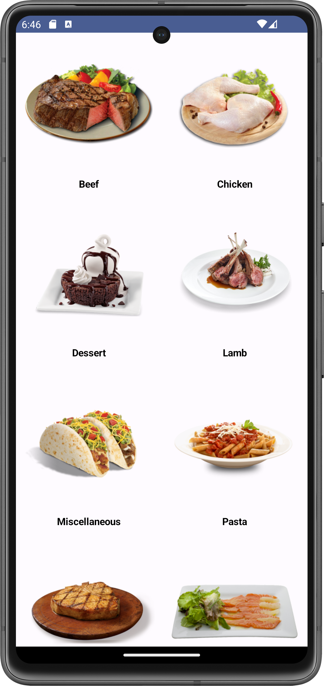

# My Recipe App

## Introduction

This repository demonstrates the development of an Android application using Jetpack Compose to display recipe categories retrieved from a free API (Meal DB). It showcases key concepts like JSON parsing, asynchronous network calls with Retrofit, coroutines (using `viewModelScope`), error handling with `try-catch`, and internet permission handling.

### Getting Started

1.  **Clone the Repository:**
    
    Bash
    
    ```
    git clone https://github.com/<your-username>/My-Recipe-App.git
    
    ```
    
   
    
2.  **Set Up Your Development Environment:**
    
    -   Ensure you have Android Studio (or another compatible IDE) installed with the necessary plugins (Kotlin, Jetpack Compose).
    -   Configure an emulator or device for testing.
3.  **Install Dependencies:**
    
    The project utilizes the following Gradle dependencies:
    
   ```kotlin
dependencies {
    // Compose ViewModel
    implementation("androidx.lifecycle:lifecycle-viewmodel-compose:2.6.2")
    
    // Network Calls
    implementation("com.squareup.retrofit2:retrofit:2.9.0")
    
    // JSON to Kotlin object mapping
    implementation("com.squareup.retrofit2:converter-gson:2.9.0")
    
    // Image loading
    implementation("io.coil-kt:coil-compose:2.4.0")

    implementation("androidx.core:core-ktx:1.13.1")
    implementation("androidx.lifecycle:lifecycle-runtime-ktx:2.8.4")
    implementation("androidx.activity:activity-compose:1.9.1")
    implementation(platform("androidx.compose:compose-bom:2023.08.00"))
    implementation("androidx.compose.ui:ui")
    implementation("androidx.compose.ui:ui-graphics")
    implementation("androidx.compose.ui:ui-tooling-preview")
    implementation("androidx.compose.material3:material3")
    
    testImplementation("junit:junit:4.13.2")
    
    androidTestImplementation("androidx.test.ext:junit:1.2.1")
    androidTestImplementation("androidx.test.espresso:espresso-core:3.6.1")
    androidTestImplementation(platform("androidx.compose:compose-bom:2023.08.00"))
    androidTestImplementation("androidx.compose.ui:ui-test-junit4")
    
    debugImplementation("androidx.compose.ui:ui-tooling")
    debugImplementation("androidx.compose.ui:ui-test-manifest")
}
```
Remember to update these versions based on project compatibility requirements.
    

## Code Structure

The code is organized into the following packages:

-   `eu.tutorials.myrecipeapp.ui.theme`: Contains the core UI components and logic for displaying recipe categories.
-   `eu.tutorials.myrecipeapp.data`: (Not currently included, but could be a place for API interaction logic)

## Key Features

-   **Network Calls with Retrofit:** Retrofit simplifies interactions with REST APIs. It parses JSON responses to Kotlin objects.
-   **Asynchronous Data Fetching:** `suspend` functions and `viewModelScope` enable safe asynchronous network calls within the ViewModel.
-   **Error Handling:** The `try-catch` block catches potential exceptions during network requests and updates the UI accordingly.
-   **Internet Permission:** The app should request the `INTERNET` permission to access the API. Instructions on handling permission requests are provided below.

## Implementation Details

1.  **`MainActivity`:** Sets up the initial UI using Jetpack Compose. It fetches categories from the ViewModel and displays them.
2.  **`RecipeState` (in `MainViewModel`):** Defines a data class to hold loading state, category list, and any errors encountered.
3.  **`MainViewModel`:** Fetches categories using `recipeService.getCategory()` in a coroutine launched with `viewModelScope`. Updates the `_categoryState` based on the response or any errors.
4.  **`ApiService`:** Defines the interface for interacting with the Meal DB API, including the `getCategory()` function.
5.  **`Retrofit` Setup:** Creates a `Retrofit` instance with the base URL and Gson converter for JSON parsing.
6.  **`CategoryScreen` and `CategoryItem`:** Handle displaying the list of categories in a grid layout.
7.  **Missing `data` Package (Optional):** Consider creating a `data` package to encapsulate data access logic (e.g., network calls) and repository patterns for better separation of concerns.

## Internet Permission Handling

In your AndroidManifest.xml file, add the following permission request:

XML

```
<uses-permission android:name="android.permission.INTERNET" />

```


## Testing (Optional)

You can write unit tests for the ViewModel and network logic using a mocking library like Mockito.

## Running the App

1.  Open the project in Android Studio.
2.  Ensure your emulator or device is connected and configured.
3.  Run the app (either on the emulator/device or in debug mode).

## Next Steps

-   Implement functionality to display individual recipe details upon category selection.
-   Enhance the UI with styling and animations.
-   Explore more advanced features like filtering or searching recipes.

## Additional Notes

-   Consider using a dependency injection framework for managing dependencies and improving maintainability.
-   Follow best practices for code formatting, comments, and documentation.

## Screenshots and Recording (Pixel7 Virtual Device)

<div align="center">

<!-- Potrait Mode -->

<p style="text-align:center;"> The app Main Screen. </em></p>

<!-- Screen Recording -->

<p style="text-align:center;"><em>The recording of the main screen.</em></p>

</div>


:bulb: **Note:** To view the actual file of the recording download the mp4 file from images section.


